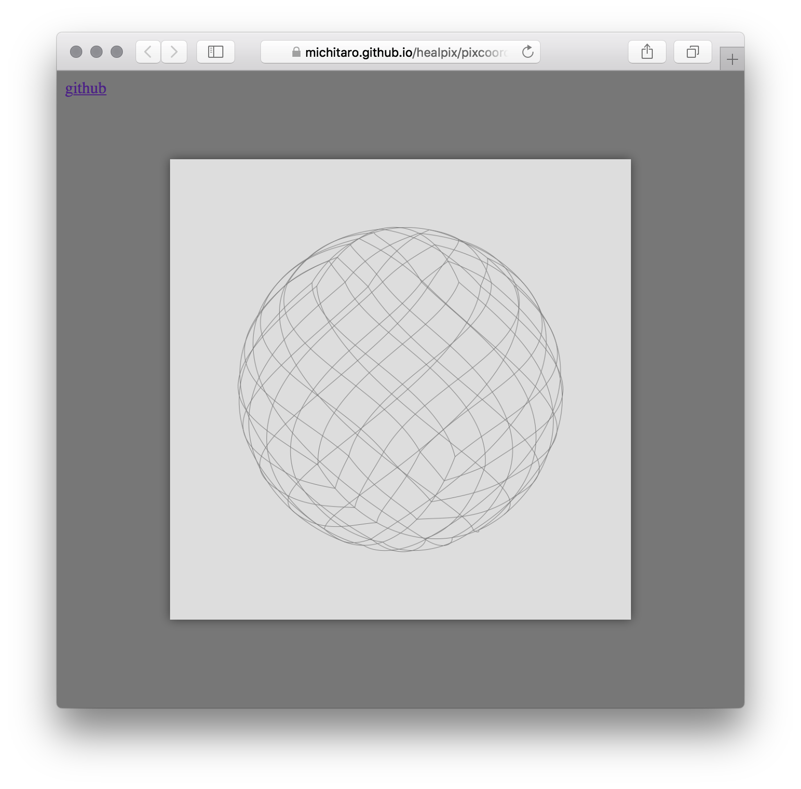

# HEALPix

## Introduction

* This module is an implementation of [HEALPix](http://healpix.sourceforge.net) in JavaScript / TypeScript.
* Pixelisation-related functions (including corners) and disk query are available
  for the ring and nested HEALPix pixelisation schemes.
* Most API interfaces are ported from wonderful [healpy](https://healpy.readthedocs.io/en/latest/)
* See [API documentation](https://michitaro.github.io/healpix/typedoc/modules/_index_.html) and [Working demo](http://michitaro.github.io/healpix/)

## Install
```sh
npm install @hscmap/healpix
```

## Example (code of [the working demo #1](http://michitaro.github.io/healpix/pixcoord2vec))



```typescript
import * as healpix from '@hscmap/healpix'
import { PerspectiveCanvas } from "./perspective_canvas"


function draw(canvas: PerspectiveCanvas, theta: number, phi: number) {
    const nstep = 8
    const nside = 4
    const npix = 12 * nside * nside

    canvas.phi = phi
    canvas.theta = theta
    canvas.clear()

    for (let ipix = 0; ipix < npix; ++ipix) {
        canvas.path(lineTo => {
            for (let i = 0; i < nstep; ++i) {
                const ne = i / nstep
                const v = healpix.pixcoord2vec_nest(nside, ipix, ne, 0)
                lineTo(v)
            }
            for (let i = 0; i <= nstep; ++i) {
                const nw = i / nstep
                const v = healpix.pixcoord2vec_nest(nside, ipix, 1, nw)
                lineTo(v)
            }
        })
    }
}


window.addEventListener('load', e => {
    const canvas = new PerspectiveCanvas(document.getElementById('main') as HTMLCanvasElement)
    draw(canvas, 0, 0)
    window.addEventListener('mousemove', e => {
        const theta = Math.PI * e.clientY / window.innerHeight
        const phi = Math.PI * e.clientX / window.innerHeight
        draw(canvas, theta, phi)
    })
})
```

## See Also
* http://healpix.sourceforge.net
* https://healpy.readthedocs.io

# License
This software is released under the MIT License, see LICENSE.
